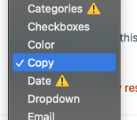

Copy Field plugin for Craft 4
===

A minimal click copy field for Craft CP

## Installation

Composer
```bash
composer require leowebguy/copy-field -w && php craft plugin/install copy-field
```

DDEV
```bash
ddev composer require leowebguy/copy-field -w && ddev exec php craft plugin/install copy-field
```

## Usage

Set field type



Click and Copy


### Need something?

PR into https://github.com/leowebguy/copy-field
